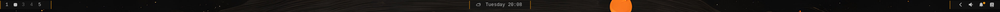
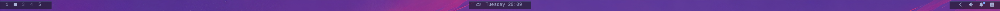
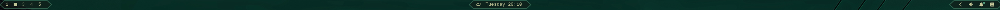
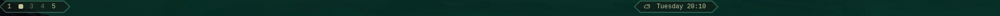
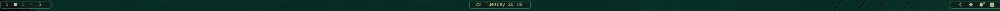
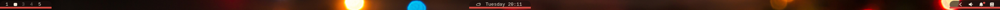

# Isles

Breathing islands behind the stock [Omarchy](https://omarchy.org/) bar. The bar stays Omarchy’s; Isles only paints chrome underneath the widgets.

One chip on the bar opens the panel: looks (cluster, pills, rail, powerline, brackets, glow), stroke style and width, fill vs stroke opacity, padding, and radius.

## What's new in 0.4.0

- Six built-in presets and a dropdown, with **Glowy** as the default for new installs.
- Save and update personal presets, with **Custom** shown when you fine-tune away from a preset.
- A scrollable settings panel and sequential settings writes with failure feedback.
- Fixed idle polling: after layout changes stop, measurement returns from a 50ms burst interval to 250ms. This reduces scheduled idle measurements from about 20 to 4 per second; it is not a measured CPU-usage reduction.
- Fixed **0% stroke opacity** and **Ends** borders for Pills and Rail.

See [the changelog](CHANGELOG.md) for release and validation notes.

## Presets

Choose a preset from the dropdown at the top of the Isles panel, then fine-tune it with the existing controls.

| Preset | Style |
|---|---|
| **Glowy** (new-install default) | Rounded Glow islands, 66% fill, no outline, 1px padding |
| **Halo** | Rounded cluster islands with a delicate full outline |
| **Pebbles** | Individual rounded pills with a subtle outline |
| **Underline** | A translucent full-width rail with a bottom accent |
| **Arrowhead** | Connected powerline chevrons |
| **Blueprint** | Lightly filled clusters with crisp corner brackets |

Presets use your current theme's colours. Glowy retains 58% stroke opacity for when you turn its stroke width up; its default width is zero.

To save your own, adjust the controls, enter a name, and click **Save** (or press Enter). Personal presets appear in the same dropdown with a **Saved** label. Enter an existing personal preset's name to **Update** it. Built-in names are reserved. Names can contain up to 40 characters.

The dropdown shows **Custom** when your settings no longer match a preset. Presets save appearance settings; the master islands toggle stays independent. Personal presets are stored in this widget's `savedPresets` setting in `~/.config/omarchy/shell.json`, so they survive shell restarts and plugin updates. Existing explicit appearance settings are preserved.

The panel scrolls when needed on smaller displays. Settings writes are applied sequentially through `omarchy bar set`; the panel reports a failure if a write cannot complete.

## A nod to Rice Bar

Isles exists because [Rice Bar](https://github.com/jcarcinogen/omarchy-rice-bar) showed that the stock bar could look designed without replacing it. Same rule, same appetite: **own the chrome, not the widgets.**

Rice Bar did that by talking to the live bar object — slot geometry, transparency, icon colours. That was the right call on Omarchy 4.0.1.

On **4.0.3** the shell stopped injecting that object into third-party widgets. Third-party code gets a postcard (size, edge, colours) and must not mutate the host. Rice Bar’s overlay still maps; it can no longer measure widgets or restyle the bar, so the islands go blank.

Isles works on 4.0.3 by staying inside the rules that are left:

- A bar-widget already sits in the shared QML scene. It walks neighbouring slots for size and visibility (the postcard does not include that tape measure).
- Chrome is drawn **in the bar window, under the widgets**, not as a second layer-shell surface stacked on top.
- Settings are this plugin’s own keys, saved with `omarchy bar set` — the same public CLI the rest of the shell uses.

No fork of `omarchy.bar`. No writing `bar.transparent` or `bar.foreground`.

## Install

```bash
omarchy plugin add https://github.com/Inxeo/omarchy-isles.git --enable
```

Put the chip where you want it (often the right cluster):

```bash
omarchy bar move io.github.inxeo.isles --section right
```

The bar should be transparent (`omarchy bar transparent true`, or double-click empty bar) so the islands show through.

Tested on **Omarchy 4.0.4-1** (Quattro shell). The plugin isolation this works around landed in 4.0.3. Later releases may change how bar slots are parented; if islands vanish after an update, that walk is the first place to look.

## Unlock the clock (recommended)

Stock Omarchy pins the clock to the **middle of the screen** (`bar.centerAnchor` is `omarchy.clock`). Isles still paints in that mode, but the center island will not pack and re-center as a group when widgets appear and vanish (Plexamp, hover icons, and so on). The clock stays glued; the huddle cannot breathe as one piece.

For the intended look — one island per section that grows, shrinks, and stays centered on the cluster — clear the anchor in `~/.config/omarchy/shell.json`:

```json
"bar": {
  "centerAnchor": ""
}
```

The file hot-reloads. The clock then sits in the middle of the **center cluster**, not the display. You do not have to do this for Isles to load; you do if you want the breathing dock.

## Left and right bar edges

Isles **does** lay out on left and right: islands follow the strip, pills and powerline stack along it.

What does **not** follow is icon colour. That is Omarchy, not Isles. A transparent bar runs `omarchy-bar-text-color`, which samples the **wallpaper along that edge** and picks the theme’s light text or the dark contrast colour. A bright side of a photo makes glyphs almost black, so they look missing on the islands.

- **Top / bottom** — usually the happy path (theme-light icons on the chrome).
- **Left / right** — chrome is in the right place; glyphs may go dark. Double-click the bar to make it solid and the light text comes back.

Isles cannot override `bar.foreground` (4.0.3 does not allow that from a third-party widget). Prefer top or bottom if you care about the screenshots below looking like your machine.

## Examples

Settings are what was used for each shot (Look, Stroke, and the sliders that matter). Wallpaper is yours.

| Preview | Settings |
|---|---|
|  | **Cluster** · Stroke **All** · Radius toward **pill** · Fill high · Stroke width 1–2 |
|  | **Cluster** · Stroke **T+B** · Radius lower (squarer) · Fill medium |
|  | **Cluster** · Stroke width **0** (no outline) · Radius pill · Fill medium |
|  | **Cluster** · Stroke **None** / width **0** · Radius pill · Fill a little higher |
|  | **Cluster** · Stroke **All** · Radius pill · Fill high |
|  | **Cluster** · Stroke **All** · Radius pill · Fill high |
|  | **Cluster** · Stroke **Ends** (chevrons) · Radius unused · Fill high |
|  | **Cluster** · Stroke **Ends** · same as above, fewer widgets in the huddle |
|  | **Cluster** · Stroke **All** · Radius pill · Fill high |
|  | **Glow** · Stroke **All** · Radius pill · Fill high (soft bloom around each cluster) |
|  | **Cluster** · Stroke **All** · Radius pill · Fill high |

Stroke **All / Top / Bottom / T+B / Sides / Ends** applies to Cluster, Pills, Rail, and Glow. Width **0** is no stroke. Fill and stroke have separate opacity sliders. Pills, Rail, Power, and Brackets are in the panel too; the shots above are the cluster/glow set.

## Looks

| Look | What it paints |
|---|---|
| Cluster | One island per bar section (left / center / right) |
| Pills | One island per icon |
| Rail | One strip the full length of the bar |
| Power | Chevron segments per icon, grouped by section |
| Brackets | Corner ticks (optional fill) |
| Glow | Cluster islands with a soft bloom |

## Remove

```bash
omarchy plugin remove io.github.inxeo.isles --yes
```

Stock widgets are untouched.

## Contributors

- **Inxeo** — design, taste, and the brief
- **Grok** ([Grok Build](https://x.ai/)) — implementation
- **OpenAI Codex** — AI-assisted code review, optimisation and bug fixes, presets, regression checks, and documentation

## License

MIT. Rice Bar remains the original chrome idea; this is a 4.0.3-era way to get a slice of that look.

## Development checks

Run `node tests/presets.cjs` for preset defaults, saving/updating, matching, persistence format, and drawing regression checks. These checks do not modify the running bar.
