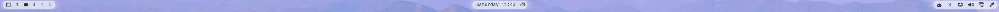
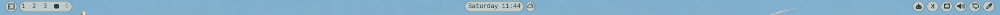
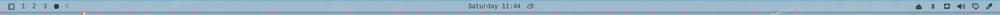

# Isles

Theme-aware islands behind the stock [Omarchy](https://omarchy.org/) bar. They resize as widgets appear and disappear, with six built-in presets and controls for saving your own looks.

**Compatibility:** tested on **Omarchy 4.0.4-1 (Quattro)**. Isles reads the bar’s internal QML layout to measure widgets; future Omarchy changes may require an Isles update. See [how it works](#how-it-works) below.

## Install

```bash
omarchy plugin add https://github.com/Inxeo/omarchy-isles.git --enable
omarchy bar move io.github.inxeo.isles --section right
omarchy bar transparent true
```

New installs start with **Glowy**. Existing appearance settings are preserved.

For the centre island to resize and recenter as a group, set `centerAnchor` to `""` inside the existing `bar` object in `~/.config/omarchy/shell.json`. Preserve the other settings. This is optional and hot-reloads automatically.

## Use the menu

1. Click the **Isles paintbrush icon** on the bar to open the menu.
2. Choose a **preset** from the dropdown, or adjust **Look** and **Border Style**.
3. Fine-tune the sliders below. Changes save automatically; the panel reports save failures.
4. To keep a custom look, enter a name and click **Save** or press Enter. Reuse a personal preset’s name to **Update** it.
5. Select a personal preset and click **Delete** to remove it. Your current appearance stays in place, and the six built-ins cannot be deleted.

The islands toggle turns the decoration on or off. The dropdown shows **Custom** when the current settings do not match a preset. Names support up to 40 characters; built-in names are reserved. Scroll the menu on smaller displays.

| Control | Effect |
|---|---|
| Look | Cluster: one island per section; Pills: individual widget islands; Rail: a full-length strip; Power: chevron segments; Brackets: corner marks; Glow: softly glowing clusters |
| Border Style | All, Pointed, Top, Bottom, T+B (top and bottom), or Sides; applies to Cluster, Pills, Rail, and Glow |
| Background Opacity | Transparency of the island background |
| Border Width | Thickness of the outline; **0** hides it |
| Border Opacity | Transparency of the outline |
| Padding | Space around the widgets |
| Corner Radius | Square to rounded corners where the selected shape supports them |

Personal presets save appearance settings independently of the islands toggle. They are stored in Isles’ settings in `~/.config/omarchy/shell.json` and survive shell restarts and plugin updates.

## Presets and examples

Colours follow your active theme. These screenshots show the stock bar with Isles across different themes and wallpapers.

### Glowy — default

Softly glowing rounded clusters, with no outline.



### Halo

Rounded clusters with a fine outline.


### Pebbles

Individual rounded islands around each widget.



### Underline

A translucent rail with a bottom accent.



### Diamonds

Individual pointed islands that show off angular outlines.


### Blueprint

Lightly filled clusters with corner brackets.


## How it works

Isles runs as a single bar-widget, with a menu loaded by that widget. It reads neighbouring bar slots’ geometry and visibility, then attaches its own drawing item beneath the widgets in the existing bar window. It does not replace the bar or change other widgets’ settings, transparency, or icon colours.

Slot discovery depends on Omarchy’s internal scene structure, rather than a stable public geometry API. Isles retries discovery and logs a warning if compatible slots cannot be found. If the islands disappear after an Omarchy update, this adapter is the first compatibility check.

Settings are written through Omarchy’s scoped API for Isles’ own entry. Isles reads `shell.json` to verify saves and attempts recovery if verification fails, without overwriting conflicting newer edits. Unsupported saved preset records are retained for future compatibility.

The installed plugin runs inside the existing shell process. It makes no network requests, launches no external commands, and requires no elevated privileges. Like other Omarchy QML plugins, it runs with the user’s permissions and is not sandboxed.

Top, bottom, left, and right bars are supported. On transparent bars, Omarchy controls icon contrast using the wallpaper; some theme and wallpaper combinations can make icons difficult to see, particularly on vertical bars. Isles does not override that colour choice.

## Remove

```bash
omarchy plugin remove io.github.inxeo.isles --yes
```

The stock widgets remain in place. Any bar transparency or centre-anchor changes you made during setup remain your own settings.

## Development

```bash
omarchy plugin validate .
qmllint -I /usr/share/omarchy/shell Widget.qml Panel.qml SettingsWriter.qml
node tests/presets.cjs
python3 tests/run-integration.py
```

The integration suite requires an Omarchy Wayland session. It uses temporary settings, a mock host API, and isolated Quickshell test processes to check the actual QML components, save recovery, preset deletion, rendering, and restart persistence. It does not alter your bar settings.

CPU/GPU savings have not been benchmarked. See [CHANGELOG.md](CHANGELOG.md) for the v1.0 changes and validation history.

## Credits and license

Inspired by [Rice Bar](https://github.com/jcarcinogen/omarchy-rice-bar) and its approach to decorating the stock bar. Omarchy 4.0.3 introduced [“Restrict third-party shell plugin capabilities”](https://github.com/omacom/omarchy/commit/1702cf0bee025aa32eddac391c4f9ac32244cfeb), replacing the live bar object supplied to third-party widgets with a scoped `PluginBarApi`. This removed the direct access to bar internals that Rice Bar’s original approach relied on. Isles brings a similar effect to Omarchy 4.0.4 by measuring neighbouring QML slots and drawing beneath the widgets, as described above.

- **Inxeo** — design, testing, and direction
- **Grok** ([Grok Build](https://x.ai/)) — implementation
- **OpenAI Codex** — AI-assisted development, review, optimisation, tests, and documentation

[MIT license](LICENSE).
